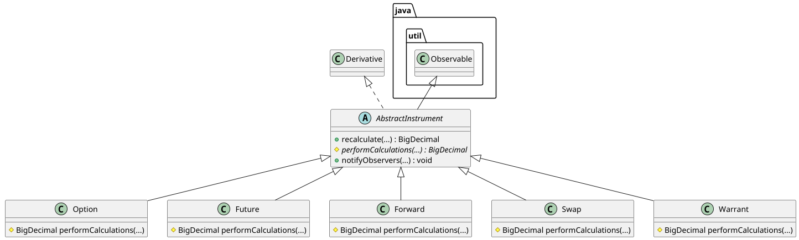
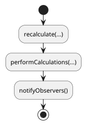

# The `switch..case` mammoth

As a Java developer, I think that there isn't anything uglier than a piece of code having in its middle a `switch` with 
43 cases. Whenever I'm seeing something like this, I remember the Windows desktop applications of my beginnings. C++ was
already *the programming language* at that time but most of the developers were writing C code and compiling it with the
Borland or Microsoft C++ compiler. The other alternative was the IBM C++ compiler for OS/2 and, then, we were dealing with
Presentation Manager, Communication Manager and others OS/2 specific stuff, including Database Manager, which came with
a mini DB2 version. A couple of years later, all this stuff got unified in Windows NT 4 but, at that moment, I have had
already moved to Unix and Linux, and it was definitive.

Anyway, I still remember these huge `switch..case` structures, on several listing pages, supposed to process all the
possible messages, like `WM_INITDIALOG`, `WM_COMMAND`, etc., and to react to different user actions through menus, 
controls, accelerators and others. They were, already at that time, broadly inadvisable and largely discouraged, but 
commonly adopted. So, imagine my surprise when, recently on this site, I came across a post discussing a design solution
for exception handling, based on a 43 cases `switch` statement. Hence, the idea to write this blog ticket.

## A realistic use case

In order to illustrate my point, I was looking for an use case and, while at it, for a realistic one, if possible. The 
previously mentioned Windows applications would have been perfect for that, but I left this field a couple of decades ago.
Accordingly, I tried to find something in FinTech, which my current field and, since most of the clients I'm working
for are banks and other financial organisations, I came to imagine a simplified derivatives example. 

Okay so, for starters, derivatives are titles whose values are contingent on the values of underlying assets, such that
interest rates or commodities like oil. They "derive" their values from the ones of the contingent resources. There are 
several types of derivatives: options, forwards, futures, swaps, warrants, etc. and, without going into details, they all
have prices, which are calculated in a specific way, depending on the derivative type.

In order to clarify expectations, I have prepared a simple Java project (https://github.com/nicolasduminil/switch-the-mammoth.git).
If you look at, you can see the class `Title` which implements several methods for the price calculation, specific to each
type of derivative. Let's look at it:

    public class Title extends Observable

    {
      private final TitleType titleType;

      public Title(TitleType titleType)
      {
        this.titleType = titleType;
      }

      public BigDecimal recalculate (CalculationData calculationData) throws IllegalTitleTypeException
      {
        BigDecimal result = performRecalculations(calculationData);
        this.notifyObservers();
        return result;
      }

      public BigDecimal performRecalculations(CalculationData calculationData) throws IllegalTitleTypeException
      {
        BigDecimal subtract = calculationData.spotPrice().subtract(calculationData.strikePrice());
        BigDecimal rate = calculationData.riskFreeRate().multiply(calculationData.timeToExpiry());
        switch (titleType)
        {
          case OPTION:
            // Option value: max(0, spotPrice - strikePrice) + timeValue
            BigDecimal intrinsicValue = subtract.max(BigDecimal.ZERO);
            BigDecimal timeValue = calculationData.volatility()
              .multiply(calculationData.timeToExpiry()).multiply(new BigDecimal("0.1"));
            return intrinsicValue.add(timeValue);
          case FUTURE:
            // Future value = spotPrice * e^(riskFreeRate * timeToExpiry)
            BigDecimal multiplier = BigDecimal.valueOf(Math.exp(rate.doubleValue()));
            return calculationData.spotPrice().multiply(multiplier);
          case FORWARD:
            // Forward value = spotPrice * (1 + riskFreeRate * timeToExpiry)
            BigDecimal rateComponent = BigDecimal.ONE.add(rate);
            return calculationData.spotPrice().multiply(rateComponent);
          case SWAP:
            // Swap value = notional * (fixedRate - floatingRate) * timeToExpiry
            BigDecimal rateDiff = calculationData.fixedRate().subtract(calculationData.floatingRate());
            return calculationData.notional().multiply(rateDiff).multiply(calculationData.timeToExpiry());
          case WARRANT:
            // Warrant value = option value * dilution factor
            BigDecimal optionValue = subtract.max(BigDecimal.ZERO);
            BigDecimal dilutionFactor = new BigDecimal("0.95"); // 5% dilution
            return optionValue.multiply(dilutionFactor);
          default:
            throw new IllegalTitleTypeException("### Illegal title type %s".formatted(titleType.name()));
        }
      }
    }

As you can see, each derivative type, be it option, future, forward, etc., has its own price calculation algorithm. These 
algorithms are all implemented in the `performRecaclculations(...)` method. It is invoked by the `recalculate(...)` method
and, once the recalculations done, all the class observers are notified, such that to eventually update prices.

Okay, so as you probably have guessed, now that we have looked at this class, my point is to say that, should you ever see
some code designed in this manner, then you mandatory have to refactor it. But why is that, what might be wrong with this code ? 
Why do you need to refactor it when all the KISS (*Keep It Simple Stupid*) advocates will tell you how easy to understand 
and convenient it is ? And as a matter of fact, I have to admit that, for being stupid, it is really stupid and, hence, 
perfect for any KISS apologist. So to answer this question, I could talk about OCP (*Open Closed Principle*), tightly 
coupling, testability, reusability, extensibility, modularity and other "[a-z]*ity" words. But instead, I prefer 
to say just that: **this code is ugly**.

Yes, you got it right, ugly ! And yes, ugliness, or more exactly esthetics, is also a software architecture and design
criteria. In this respect, software architecture is similar to civil architecture. Imagine two house projects side by
side, one having only one large room with everything inside, a second one with different living spaces, bathrooms,
kitchens, designed such that to fulfil the needs of the inhabitants, where the architect has meticulously designed every 
detail and carefully planned the finishing touches. Which one would you prefer ? Well, software architecture is similar:
it has to be beautifull.

## Refactoring the mammoth: step 1

Okay, so let's refactor now our `switch..case` mammoth. And our first approach will be using polymorphism. Having said
that, I'm aware that I lost almost all my OOP phobist readers who hate polymorphism because it is not supported by Rust.
Well, when I'm saying that Rust doesn't support polymorphism, what I'm trying to say is that they needed to change
the polymorphism definition in order to claim that Rust supports it. Anyway, Rust is beyond OOP and,
accordingly, it doesn't have to support polymorphism, neither anything else. Rust is beyond everything. 
But this is another discussion.

Let's look at the class diagram below:

As we can see, this class diagrams models the derivatives business domain in the form of a class hierarchy whose root is the
`AbstractTitle` class which, as its name implies, is an abstract one. It extends `Observable` such that it supports observers
that it could notify as soon as recalculations were done. Each derivative type is, subsequently, modelled as a subclass of 
this abstract class. This is important in order to recognize the fact that options, futures, forwards and warrants are all 
derivatives.

The recalculations are done by two methods: `recalculate(...)` and `performCalculations(...)`, as shown by the activity 
diagram below:

Here is the code:

    public abstract class AbstractTitle extends Observable implements Derivative
    {
      protected TitleType titleType;

      protected AbstractTitle(TitleType titleType)
      {
        this.titleType = titleType;
      }

      public BigDecimal recalculate(CalculationData calculationData) throws IllegalTitleTypeException
      {
        BigDecimal titlePrice = performCalculations(calculationData);
        this.notifyObservers();
        return titlePrice;
      }

      public abstract BigDecimal performCalculations(CalculationData calculationData) throws IllegalTitleTypeException;
    }

So, the `recalculate(...)` method is in charge of the price calculation and, since this process is different for each
type of derivative, the effective algorithm implementation is delegated to the `performCalculations(...)` method,
declared here as abstract. Then, it is the obligation of each subclass to implement this method. For example, here is
how it looks in the `Option` class:

    public class Option extends AbstractTitle
    {
      protected Option(TitleType titleType)
      {
        super(titleType);
      }

      // Option value: max(0, spotPrice - strikePrice) + timeValue
      @Override
      public BigDecimal performCalculations(CalculationData calculationData)
      {
        BigDecimal intrinsicValue = calculationData.spotPrice()
          .subtract(calculationData.strikePrice()).max(BigDecimal.ZERO);
        BigDecimal timeValue = calculationData.volatility()
          .multiply(calculationData.timeToExpiry())
          .multiply(new BigDecimal("0.1"));
        return intrinsicValue.add(timeValue);
      }

      @Override
      public TitleType getTitleType()
      {
        return TitleType.OPTION;
      }
    }

What we've implemented here is the *strategy* pattern, also called the *template method* one. But what about this 
`Derivative` interface that can be seen in the class diagram above ? Well, it allows us to handle in a 
generic way derivatives. Now, given this new implementation, our derivative price calculation is as simple as that:

    ...
    Derivative option = ... //some abstract factory to build options
    option.recalculate(...);
    ...

Let's look now more carefully at how we could improve further our design.

## Refactoring the mammoth: step 2

Okay, so we refactored our initial `Title` class such that to replace the `switch..case` mammoth by polymorphism and,
the result of this refactoring is to have 6 classes instead of one. Here, our friends, the KISS advocates, will throw up
their hands in horror. And they are right to point that our design here doesn't observe the KISS principle 
as it isn't stupid at all. This refactoring is what they call *over-engineering* and they identify it as being the most 
serious issue in the software industry. As opposed to them, I think that the most serious issue of the software industry
is the poor design and the over-simplification, leading to stupid implementations and ugly code. 

So, let's go now further and, after the *strategy* pattern, lets apply the *registry* one as well. Look at the 
`CalculationRegistry` class below:

    public class CalculationRegistry<T, R>
    {
      private final Map<T, Function<R, BigDecimal>> strategies = new HashMap<>();

      public void register(T key, Function<R, BigDecimal> strategyFunc)
      {
        strategies.put(key, strategyFunc);
      }

      public BigDecimal apply(T key, R request)
      {
        return strategies.getOrDefault(key, r -> BigDecimal.ZERO).apply(request);
      }

      public void unregister(T key)
      {
        strategies.remove(key);
      }

      public void clear()
      {
        strategies.clear();
      }

      public Map<T, Function<R, BigDecimal>> getStrategies()
      {
        return strategies;
      }
    }

This is a generic class parameterized with a derivative type and a price calculation strategy. The `T` generic
argument represents a derivative type while the `R` one is the strategy to be applied to calculate the given
derivative price. It implements the *registry* pattern, quite commonly used for the kind of processing that we're
here at, by maintaining a map which associates a calculation strategy to a derivative type. For example:

    Calculationregistry<TitleType, CalculationData> calculationRegistry = new CalculationRegistry<>();
    calculationRegistry.register(TitleType.OPTION, data ->
    {
      BigDecimal intrinsicValue = data.spotPrice()
        .subtract(data.strikePrice()).max(BigDecimal.ZERO);
      BigDecimal timeValue = data.volatility()
        .multiply(data.timeToExpiry())
        .multiply(new BigDecimal("0.1"));
      return intrinsicValue.add(timeValue);
    });

The code above registers the strategy required for the price calculation of options. Now, in order to effectively
perform the operation:

    BigDecimal optionPrice = calculationRegistry.apply(TitleType.OPTION, testData);

This way we're embracing the functional programming style available in Java since its 8th release. This allows us to
use strategies, i.e. methods, as data, by passing them as input arguments and storing them in maps. Don't hesitate to 
look at the unit test `TestCalculationRegistry` to make sure you understand how everything works. And to run these tests.

Conclusion: while over-engineering might be an issue, leading to hardly maintainable code, the most important
issue of the software industry is the over-simplification and the poor design. 
So, keep it simple but not simplistic and, above all, not stupid !